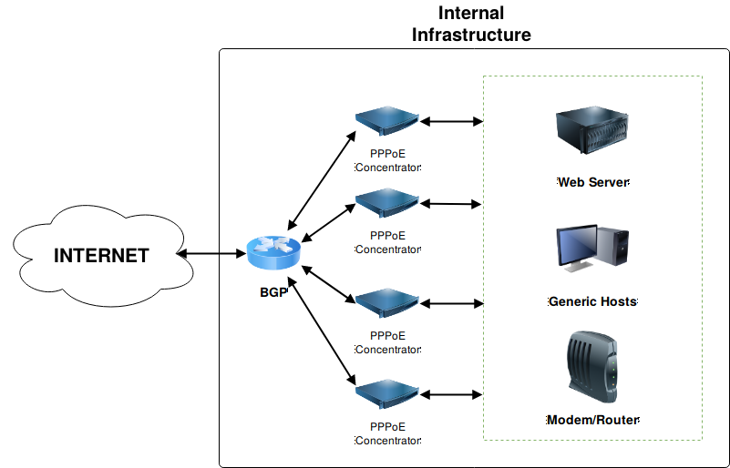

# SLS DDoS Attack Dataset (2018)
## Description
This dataset consists in approximatedly 2.5 hours of network capture in NetFlow format containing a real Volumetric DDoS Attack. The capture started at 05, April 2018 03:25:00 BRST and ended at 05, April 2018 06:00:00 BRST. The attack started around 05, April 2018 04:00:00 BRST against a single host with Internet access behind a single PPPoE concentrator. The capture was made in the BGP. The image below illustrates the infrastructure where de capture was made.

 The victim host IP address is **"8.173.37.51"**, it had a 50MB/s link and did not hosted any service. The table below details the files that compose this dataset.

|      File       | Size |        Description            | Download | md5
|:---|:---|:---|:---|:---|
| sls-dataset.tar.gz | 6.1GB (36GB uncompressed)  | Compressed captures        | [click to download](https://files.mycloud.com/home.php?brand=webfiles&seuuid=6eabef3b07ebbc395d0f7a48941c6d45&name=sls-dataset-001.tar_3 "SLS_Dataset") | 15856fb4c00e69daf09acfb2d83fc72c |
| sls-anon.nfdump |  19G  | Complete bidirectional flows | NA | 0517d174ecc5599486f15de931428f13 |
| sls-tovictim.nfdump | 18GB | Flow from network to victim only | NA | 31531539a1586163b6163f0c241f8e47 |
| sls-fromvictim.nfdump | 352 B | Flow from victim to network only (responses) | NA | da4f039184a6409e48eb892fcb354cf9 |

Table: Dataset files description.

*note: You must add 
## Citation

To cite this dataset please cite the paper "Identificando Botnets Geradoras de Ataques DDoS Volumétricos por Processamento de Sinais em Grafos", FERREIRA, Arthur E. G.; NOGUEIRA, Michele. Workshop de Gerência e Operação de Redes e Serviços (WGRS_SBRC), [S.l.], v. 23, may 2018. ISSN 2595-2722.

## Authors
* Arthur E. Garcete Ferreira - UFPR [<arthurgarcete@gmail.com>]
* Michele Nogueira Lima - UFPR [<michele@ufpr.br>]

**Special Thanks** to Mr. Alexandre C. Carvalho (Specialist Linux Solutions) [<alexandre@specialist.srv.br>] for providing the NetFlow capture composing this _dataset_ and authorizing its publication.
